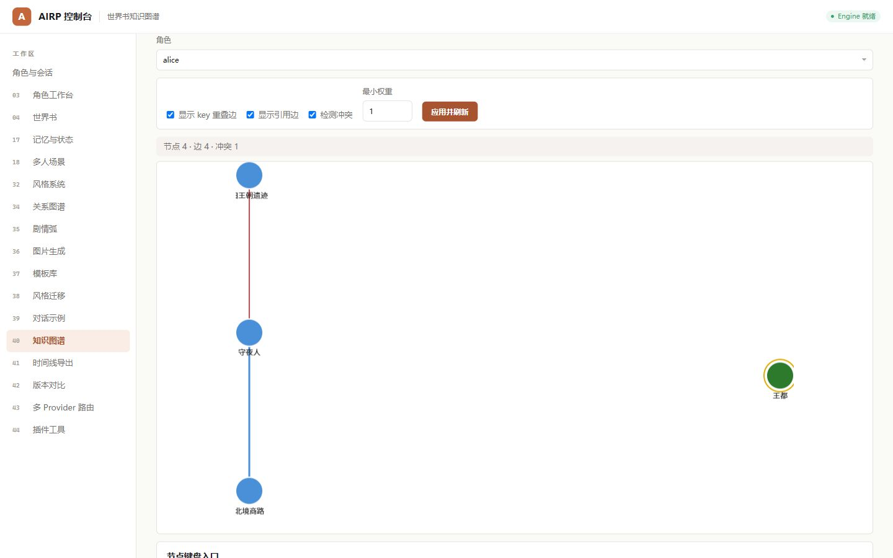
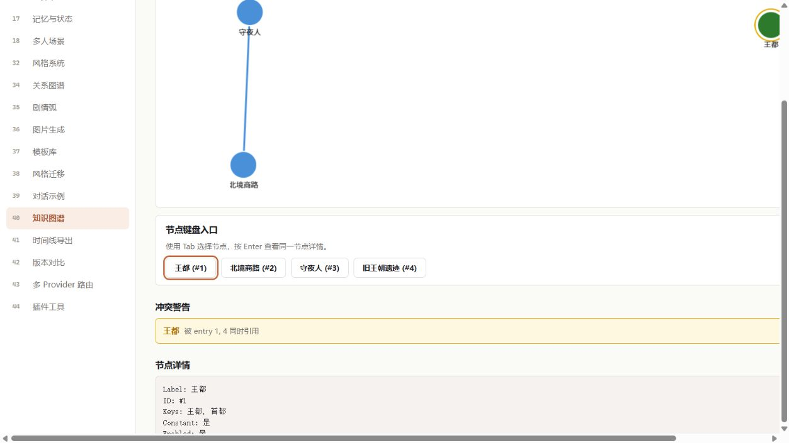
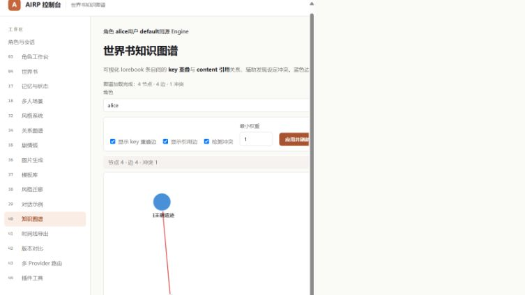

# PR #558 多模态视觉补审

- 日期：2026-08-13
- 审查对象：commit `148260f` 加本次补审修正
- 模型：Codex GPT-5 多模态运行时（满足 issue #319 的 GPT-5 Vision 级别要求）
- 立场：独立复核，不采用开发者“已自测”作为视觉证据
- 裁决：**通过；无阻塞项**

## 实际渲染与交互

本次用真实 Chromium 渲染 `40-worldbook-graph.html`，并由本模型实际查看截图。为覆盖数据态，测试服务返回 4 个节点、4 条边和 1 条冲突；未修改产品代码来伪造 DOM。

键盘使用 Enter 激活“王都”节点后，节点详情正确出现，画布中的对应节点同步高亮。键盘入口的焦点环清晰可见，按钮文字、间距和颜色与现有控制台 token 一致。

## 审查维度

- 视觉一致性：新增区块沿用现有 surface、border、radius、按钮与文本 token；层级清楚。
- 布局正确性：桌面数据态没有新增重叠；按钮可换行。768 px 窄屏复核见下图。
- 可访问性：入口为真实 `button`；Tab/Enter 路径有效；焦点环清晰；节点详情是画布的文本等价物。
- 交互完整性：Enter 激活节点、详情更新、画布选中态均已实际验证。
- baseline 偏离：新增键盘入口是有意的可访问性增强，没有破坏原画布主视图。

## 发现与处置

### V1（已修复）默认列表项目符号污染按钮组

首次渲染时，`ul.graph-node-list` 的默认项目符号显示在首个按钮前。补审已将该列表的 `margin`、`padding` 与 `list-style` 归零，并重新截图确认消失。

### N1（非阻塞、继承问题）控制台窄屏仍存在横向溢出

768 px 视口下，控制台主骨架和固定侧栏仍会压缩/裁切右侧控件；该现象来自既有控制台/画布布局，不由本 PR 的键盘入口引入。按仓库规则，本项不阻塞 #558，但须在 #558 合并后去重并登记 follow-up issue。

## 自动化证据

- `node --test webui/tests/worldbook-graph.test.mjs webui/tests/dialogue-flow.test.mjs`
- `node --test webui/tests/*.test.mjs`（204/204 通过；含审计后新增的陈旧统计/冲突清理回归）

结论：PR #558 在补入 V1 修正后满足 issue #319 的多模态视觉审查要求，可以进入最终 CI/审计门禁。
