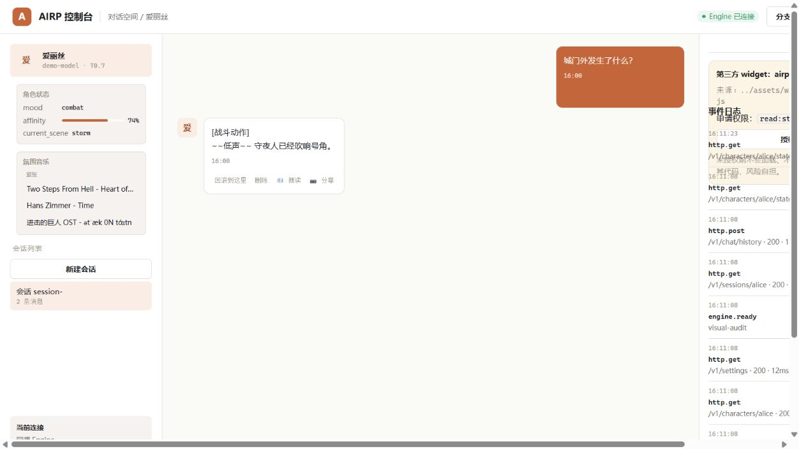

# PR #559 多模态视觉补审

- 日期：2026-08-13
- 审查对象：PR #559 当前分支（同步 `main` 后）
- 模型：Codex GPT-5 多模态运行时（满足 issue #319 的 GPT-5 Vision 级别要求）
- 立场：独立复核，不采用开发者“已自测”作为视觉证据
- 裁决：**通过；无阻塞项**

## 实际渲染证据

本次用真实 Chromium 渲染 `02-chat-space.html`。测试服务提供角色、会话、两条消息和 `mood: combat` 状态，使 BGM 建议卡、消息气泡与 TTS 操作入口进入实际数据态；本模型实际查看了下图。

截图中的助手消息保留 `[战斗动作]` 与 `~~低声~~` 是正确的屏幕展示；本 PR 只在用户点击“朗读”后清理送入 Web Speech API 的文本，不应篡改可见消息。鼠标 hover 后“🔊 朗读”入口实际出现。`mood: combat` 只从允许的语义字段触发“紧张”BGM 卡片。

## 审查维度

- 视觉一致性：BGM 卡片、消息操作和状态条继续使用既有组件样式及设计 token。
- 布局正确性：本 PR 没有新增 DOM/CSS，也未造成新的重叠或跳动。
- 可访问性：朗读入口为带可见文字的真实按钮；消息正文不会因 TTS 清理而视觉丢失。
- 交互完整性：BGM 数据态和消息 hover 操作态均已实际渲染；文本清理由自动化测试验证。
- baseline 偏离：无视觉设计偏离；改动局限于 BGM 语义匹配和传入 TTS 的文本。

## 发现与去重

控制台既有三栏骨架在当前窄窗口仍可出现横向溢出/右栏裁切。该继承问题已由 PR #558 审计 N1 登记为 issue #570，本审计不重复建项，也不阻塞 #559。

## 自动化证据

- `node --test webui/tests/chat-space.test.mjs`
- `node --test webui/tests/*.test.mjs`（207/207 通过）

结论：PR #559 满足 issue #319 的多模态视觉审查要求，可以进入最终 CI/审计门禁。
